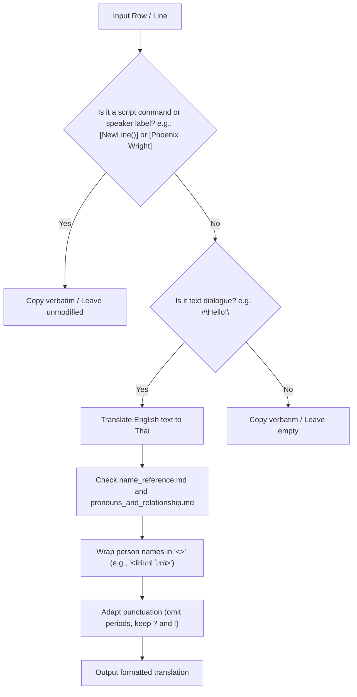

# Agent Translation & Localization Guide

This guide establishes the technical rules, script syntax, formatting conventions, and token optimization workflow for agents localizing the *Phoenix Wright: Ace Attorney* series into Thai.

---

## 1. Translation Workflow

Use the following flowchart to process script files:



---

## 2. Core Translation Rules

### Rule 1: Script Line Integrity
Lines containing commands or speaker labels enclosed in brackets `[...]` **must not** be translated. Copy them verbatim.
- **Speaker Labels:** `[Phoenix Wright]`, `[Lana]`, `[Judge]`, `[Unknown Speaker]`, etc.
- **Control Commands:** `[NewLine();]`, `[ReadKey();]`, `[Wait(20);]`, `[ClearText();]`, `[Op_2D();]`, etc.
- *Note:* Use these bracketed lines as context to understand who is speaking, when lines break, and how the text flows.

### Rule 2: Dialogue Formatting (`#"text"`)
Dialogue text in the script files is enclosed in double quotes with a leading hash mark: `#"dialogue text"`.
- Preserve this `#"..."` format perfectly.
- Ensure only **straight double quotes** (`"..."`) are used inside dialogue strings. Never use curly quotation marks (`“...”` or `‘...’`) or other variants.
- **No Backslashes for Internal Quotes:** Do not use backslashes (`\`) to escape internal double quotes inside dialogue strings (e.g., use `#"นี่คือ "เฟี้ยวฟ้าว" ครับ"` instead of `#"นี่คือ \"เฟี้ยวฟ้าว\" ครับ"`).

### Rule 3: Distribute Dialogue & Preserve Line Counts
In English scripts, dialogue is often split across multiple consecutive lines to fit the text box layout.
- **Rule:** Translate the entire dialogue section/segment as a whole, then **distribute** the translated Thai text across the original lines as closely to the original layout and line breaks as possible, keeping the sentence natural and flowing.
- **Minimize Squashing:** Squash only sparingly. Do not combine lines and leave subsequent lines as empty `#""` unless a segment is too short or grammatically inseparable in Thai.
- **Handling Mandatory Squashing:** If you must merge lines:
  - Put the merged translation in the first dialogue line of that group.
  - Format subsequent merged lines strictly as an empty string: `#""` (never write `#"#"""` or nested quotes).
- **Command Context Warning:** Always inspect the surrounding commands to determine if the text is continuous or belongs to a different dialogue bubble/screen:
  - **Text Box Clears (`[ReadKey();]` and `[Op_...();]`):** These clear the entire text box. Any dialogue following them is **not continuous** with the dialogue preceding them.
  - **Forced Line Breaks (`[NewLine();]`):** This forces a line break *within the same* dialogue bubble (continuous text).
  - **Inline Commands (`[Wait(N);]`, `[SetTextColor(Color);]`):** Pauses or visual format cues. The text remains continuous across them.

---

## 3. Formatting & Mechanical Rules

### A. Phonetic Stuttering
In Thai, vowel markers (e.g., `เ`, `แ`, `ไ`, `ใ`, `โ`) are written before the initial consonant. Do not stutter on the written vowel (e.g., `ไ-ไ-ไม่` or `เ-เ-เท่าไหร่`). Systematically format stutters to repeat the **consonant sound** that is actually spoken:
- **Incorrect:** `ไ-ไ-ไม่` $\rightarrow$ **Correct:** `ม-ม-ไม่` (M-M-Mai)
- **Incorrect:** `เ-เ-เท่าไหร่` $\rightarrow$ **Correct:** `ท-ท-เท่าไหร่` (T-T-Tao-rai)
- **Incorrect:** `ใ-ใ-ใช่` $\rightarrow$ **Correct:** `ช-ช-ใช่` (Ch-Ch-Chai)
- **Incorrect:** `ตุ๊-ตุ๊-ตุ๊กตา` $\rightarrow$ **Correct:** `ห-ห-หุ่น` (H-H-Hun)
- **Incorrect:** `ย... แย่แล้ว!!` $\rightarrow$ **Correct:** `ง-ง-ง-งานเข้าแล้ว!!` (Ng-Ng-Ng-Ngan khao laew)

### B. Dialogue Color Highlights (`[SetTextColor(Color);]`)
Dialogue text in Ace Attorney often highlights key words (such as names, clues, or evidence) in red, blue, or other colors using the color command.
- **Rule:** Do not squash or combine translated words that are highlighted in the original script into a single line. The translated highlighted word **must be placed between** the non-white color command and the `[SetTextColor(White);]` reset command, exactly matching the original structure so that the highlighting works correctly in-game.
- **Example:**
  - *Original:*
    `#"of"`
    `[SetTextColor(Red);]`
    `#" Acro"`
    `[SetTextColor(White);]`
    `#" in his room on the"`
  - *Correct translation:*
    `#""`
    `[SetTextColor(Red);]`
    `#"<อัคโคร>"`
    `[SetTextColor(White);]`
    `#"อยู่ที่ห้องของเขาบนชั้น 3"`

### C. Spacing and Whitespace Rules
1. **Preserve Spacing on Continuous Text:** For dialogue lines that continue a sentence/phrase without a line break (i.e., not separated by `[NewLine();]` or a screen-clear command like `[ReadKey();]`), spacing must be preserved. For example, `#"You know," [Wait(10);]` followed by `#" if she wasn't so"`. Ensure the leading space is kept in Thai so words do not run together.
2. **Flush-Left on Line Breaks (No Leading Spaces):** Dialogue lines immediately following a `[NewLine();]`, `[ReadKey();]`, or screen-clear commands **must not** have a leading space. In-game, these commands force a fresh line or clear the screen, so starting with a space causes an ugly, unintentional text indentation.
   - **Incorrect:**
     `[NewLine();]`
     `#" ไหนสักที่แล้วล่ะ..."`
   - **Correct:**
     `[NewLine();]`
     `#"ไหนสักที่แล้วล่ะ..."`

### D. Polite Particle Distribution & Casual Particle Usage
1. **Polite Particle Distribution:** Ace Attorney text boxes break dialogue into sub-lines. Do not append polite particles (`ครับ`, `ค่ะ`, `เจ้าค่ะ`) to every sub-line. Place these particles **only at the end of the complete thought block** (before `[ReadKey();]` or a screen-clear command) while intermediate lines end naturally without particles, preventing repetitive and unnatural stuttering in tone.
2. **Selective Casual Particles:** For characters with casual registers (like Maya Fey), do not over-use casual particles (such as `นะ`, `น่ะ`, `ล่ะ`, `เนอะ`) on every sub-line. Keep the overall dialogue flow natural and use them selectively so they do not sound repetitive or childish; simply ensuring she does not sound formal with Phoenix is enough to establish her register.

### E. Green Date/Location Cards
In the location and time overlay headings (e.g. `[SetTextColor(Green);]`), the word **`เวลา`** (time) is systematically omitted to keep the overlay clean and authentic.
- **Incorrect:** `26 ธันวาคม เวลา 20:12 น.`
- **Correct:** `26 ธันวาคม 20:12 น.`

### F. Redundant Context Omission
Extra phrases that are already clear from the immediate visual context should be dropped to keep the dialogue punchy.
- **Example:** `ในศาลจะมีอัยการคนไหนมาทำคดี?` $\rightarrow$ `จะมีอัยการคนไหนมาทำคดี?` (dropping "in court" as it is visually obvious).

### G. Punctuation
- **Omit English Periods (`.`):** Thai grammar does not use periods at the end of sentences. Omit trailing periods.
- **Preserve `?` and `!`:** Unlike standard Thai, preserve question marks, exclamation marks, and ellipses (`...`) to retain the dramatic anime-style pacing.
- **Question Particles:** Shorten clunky endings like `"...งั้นเหรอ?"` or `"...หรอคะ?"` to standard conversational forms like `"...เหรอ?"` or `"...เหรอครับ?"` to keep dialogue punchy.

### H. Pacing and Wait Commands (`[Wait(N);]`)
Game dialogue utilizes engine commands to deliver text with specific pacing and dramatic delivery.
- **Preserve Pause Splits:** When a `[Wait(N);]` command sits between two lines of text in a dialogue block, it is intended to create a pause in speech delivery. Do not squash or combine text across a `[Wait(N);]` command. Keep the text before the wait on the pre-wait line, and the text after the wait on the post-wait line (e.g., separating "เอาเป็นว่า..." and "ที่นี่แหละ" across `[Wait(15);]`).
- **Preserve Breathless/Gasping Splits:** When dialogue is split across multiple short consecutive lines without explicit wait or newline commands (e.g. `#"I..."` followed by `#" can't"`, `#"..."`, `#" breathe"`, `#"..."`), it is designed to print slowly to create a breathless, gasping effect. Avoid combining these into a single line; distribute the Thai translation across the original lines (e.g., `#"ผม..."`, `#" หาย"`, `#"ใจ"`, `#" ไม่"`, `#"ออก..."`) to replicate this gasping timing.

---

## 4. Token Optimization Strategy (Using `translate_helper.py`)

To avoid wasting LLM tokens on empty lines, formatting instructions, and repetitive speaker commands, use the provided [translate_helper.py](file:///home/beaver_bloyde/Desktop/ATT%20Project/AI%20Training/Scripts/translate_helper.py) script located in the `Scripts/` directory.

### Workflow Commands:

#### Step 1: Extract dialogue lines
Run the script to pull out dialogue lines from a script CSV into a compact TXT file:
```bash
python3 Scripts/translate_helper.py extract -i "Example/sc4_0a_text_u.mdt - Example.csv" -o "sc4_0a_dialogue.txt"
```

#### Step 2: Feed dialogue text to the LLM
Provide the extracted TXT file to the LLM with instructions pointing to `Guides/name_reference.md` and `Guides/pronouns_and_relationship.md`.

#### Step 3: Proofread and Verify Translation
Before merging, run the verify command on the translated TXT file to scan for structural and formatting issues (e.g. mismatched tags, odd quote counts, backslashes, spacing anomalies):
```bash
python3 Scripts/translate_helper.py verify -t "sc4_0a_translated.txt"
```
Fix any reported errors before proceeding.

#### Step 4: Merge translated dialogue back into the CSV
Once verification passes, merge it back:
```bash
python3 Scripts/translate_helper.py merge -g "Example/sc4_0a_text_u.mdt - Example.csv" -t "sc4_0a_translated.txt" -o "sc4_0a_text_u_translated.csv"
```
